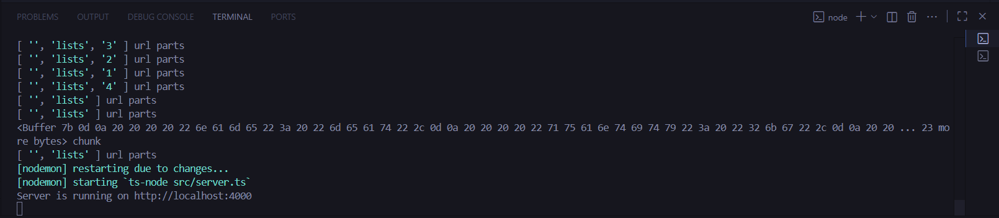
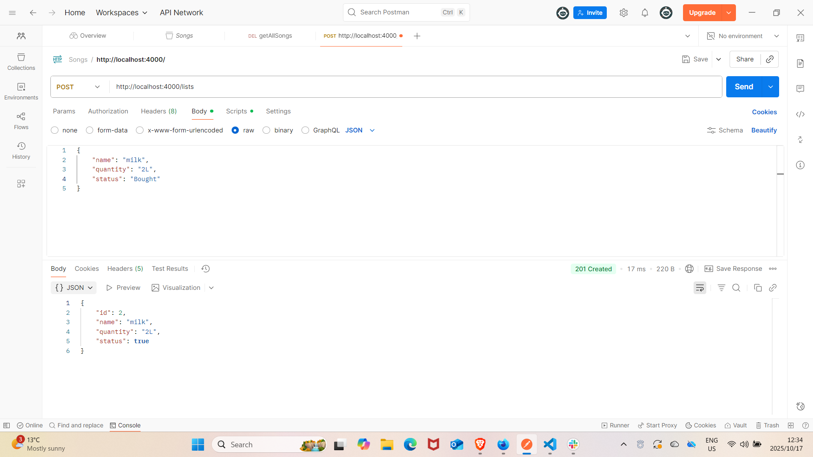
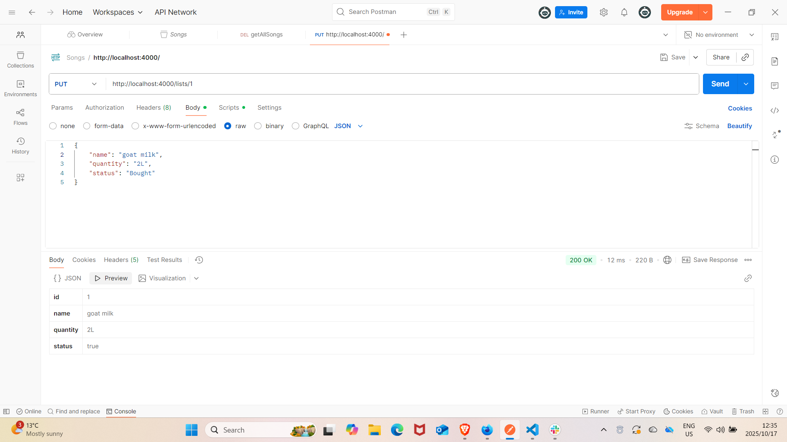
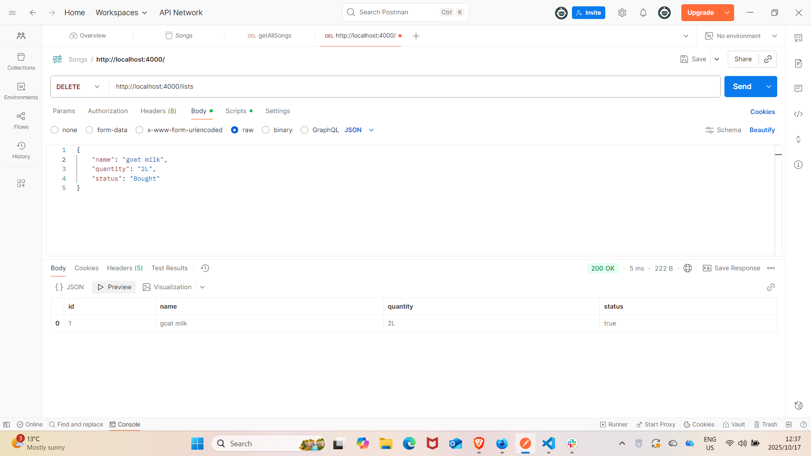

# Shopping List API


A simple **Node.js + TypeScript** in-memory shopping list API that allows you to **add, read, update, and delete items**.  
Each item has a name, quantity, and status (bought or pending).

---

## Features

- CRUD operations on shopping list items
  - `GET /lists` → fetch all items
  - `GET /lists/:id` → fetch a single item
  - `POST /lists` → add a new item
  - `PUT /lists/:id` → update an existing item
  - `DELETE /lists/:id` → delete an item
- Status can be **case-insensitive** (`Pending`, `pending`, `PENDING` all work)
- In-memory storage (no database required)
- Type-safe with TypeScript

---

## Installation

In your VSCode terminal, e.g.

```bash

git clone https://github.com/<your-username>/shopping-list-api.git
cd shopping-list-api

npm install

npm run dev
```

Server will run at: http://localhost:4000

## API Endpoints

In your prefered API platform, e.g. Postman

This is the list of all the things you can do: 
---
- GET /lists
- GET /lists/:id
- POST /lists
Content-Type: application/json

{
  "name": "Milk",
  "quantity": "2L",
  "status": "Pending"
}

- PUT /lists/:id
Content-Type: application/json

{
  "name": "Milk",
  "quantity": "3L",
  "status": "Bought"
}

- DELETE /lists/:id

## Data model 

export interface List {
  id: number;
  name: string;
  quantity: string;
  status: boolean; // true = bought, false = pending
}

## Screenshots








